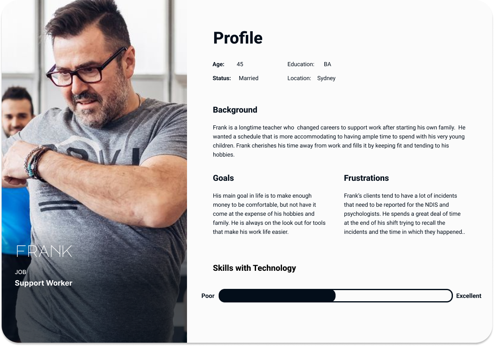
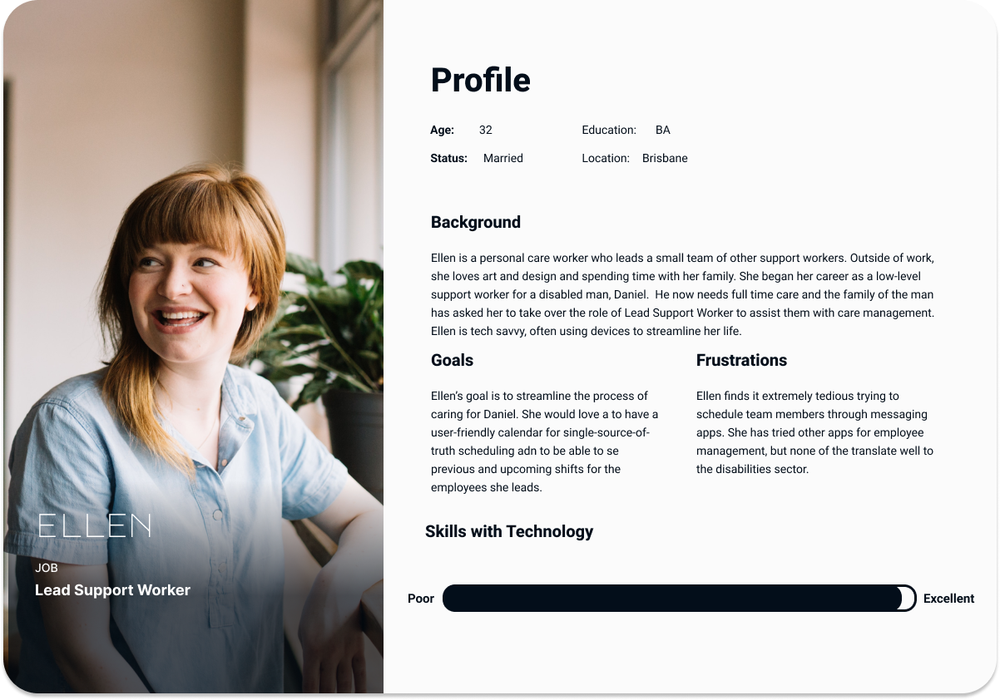

# T3A2-A Full Stack App

 

## Description of Website
### <strong>Purpose</strong>
The purpose of this website is to allow small, self-managed teams of personal carers and support workers to easily create and edit shift notes, incident reports, and handover information as well as provide a rostering system to help organize the workers.  In short, this application intends on streamlining scheduling, communication, and provision of care.

### <strong></strong>

##
### <strong>Functionality/Features</strong>
- Keep a log of each shift including general notes, incident reports, and handover for the next worker.
- Add shift dates and times to a shared roster/calendar.
- Provide the ability to download reports for for use in funding applications and psychologist/medical appointments.

### <strong>Target Audience</strong>
The target audience of the application is those who both employ and work in the support/disabilities sector. 

### <strong>Tech stack</strong>
The tech stack that is utilized in this application is MERN stack:

- MongoDB: Used for storage fo the application's data.
- Express: A framework for Node used to expedite the API development process.
- React: A JavaScript library for building user interfaces.
- Node: An open-source server environment that allows for asynchronous programming.

 

## Dataflow Diagram

 

## Application Architecture Diagram
### MERN Stack
MERN stack is a web development framework that consists of the stack MongoDB, Express.js, React.js, and Node.js.  React is used to create the front-end, Express is used as the server-side framework which runs inside a Node server, and MongoDB is used to store any data. This stack allows for rapid development due to the extensive utilization of a single language: JavaScript. 

 

## User Personas/Stories

### <strong>Employee Personas:</strong>

### <strong>Employer Personas:</strong>

### <strong>Employee User Stories:</strong>

<strong>Frank-</strong> 
As Frank, a support worker looking for easier access to forms, I want to be able to write and submit incident reports throughout my shift, so that I can write them while they are still fresh in my mind.

<strong>Rosa-</strong> 
 As Rosa, a young support worker looking to streamline the handover process, I want to have quick and easy access to handover notes, so that I can avoid any downtime when my shift starts.

<strong>Grace-</strong> 
As Grace, a support worker that likes to take her clients to do new activities, I want to be able to review historical shift notes so that I can keep my clients doing activities that weren’t done in the days leading up to my shift.

 

### <strong>Employer User Stories:</strong>

<strong>John-</strong> 
As John, a parent who employs carers for an adult son with care needs, I want a way to store all shift notes and incident reports produced by care workers electronically so that I can easily review and retrieve them by date.

<strong>Ellen-</strong> 
As Ellen, the lead support worker for a small team of carers, I would love a place to schedule myself and teammates for care shifts and view a calendar of upcoming shifts so that we can all have a central place to view our roster and avoid miscommunication.

<strong>Sandra-</strong> 
As Sandra, the care coordinator for a small business that assigns carers for many patients, I need a single app that I can use to keep track of all carers assigned to our patients so that I can better manage scheduling.

## Wireframes

## Trello