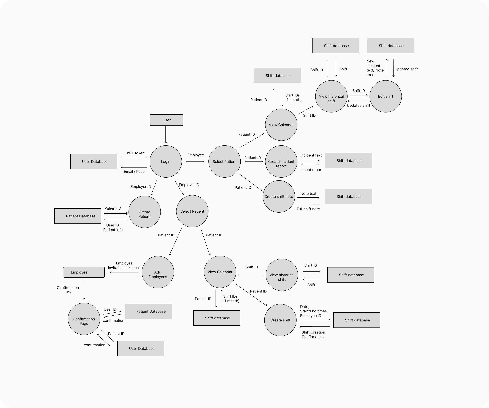
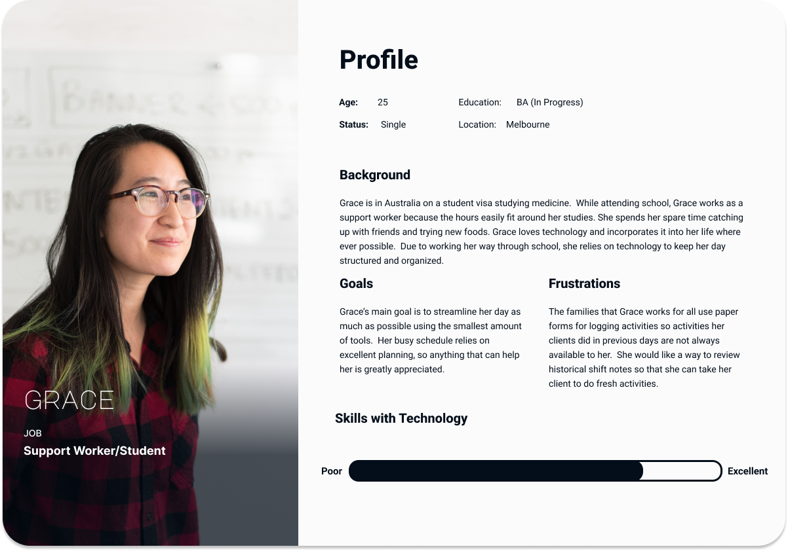
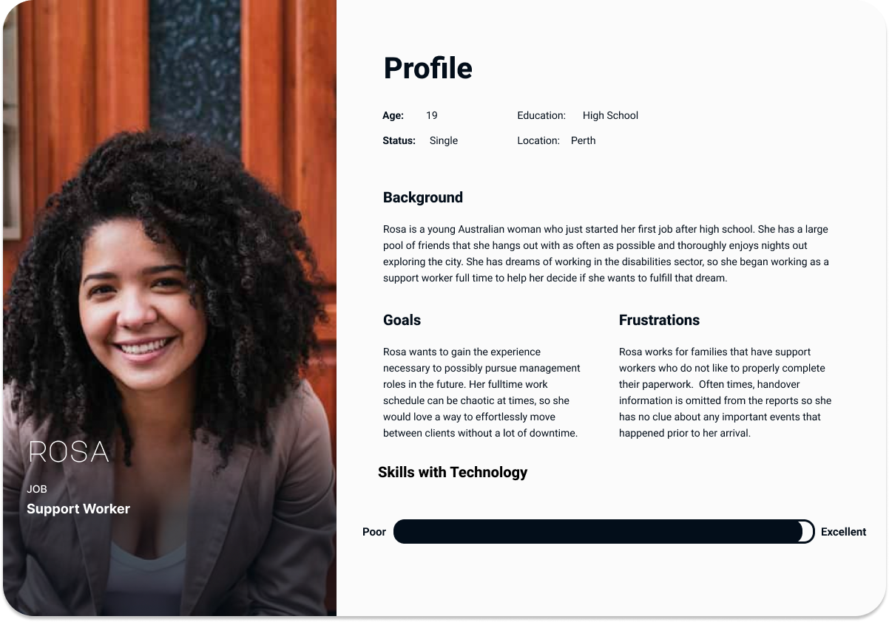
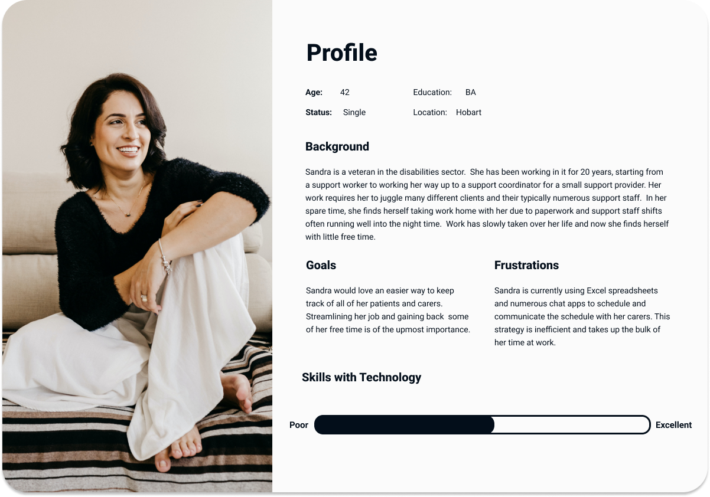
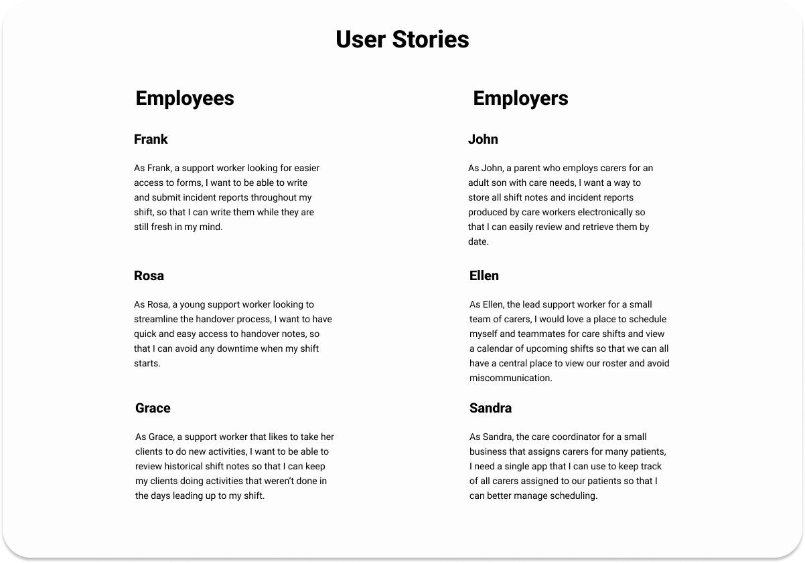

# T3A2-A Full Stack App

 

## Description of Website
### <strong>Purpose</strong>
The website is a shift notes and rostering system for small, self-managed teams of personal carers and support workers.  It will assist in streamlining scheduling, communication, and provision of care.

### <strong>Functionality/Features</strong>
- Keep a log of each shift including general notes, incident reports, and handover for the next worker.
- Add shift dates and times to a shared roster/calendar.
- Provide the ability to download reports for for use in funding applications and psychologist/medical appointments.

### <strong>Target Audience</strong>
The target audience of the application is those who both employ and work in the support/disabilities sector. 

### <strong>Tech stack</strong>
The tech stack that is utilized in this application is MERN stack:

- MongoDB: Used for storage fo the application's data.
- Express: A framework for Node used to expedite the API development process.
- React: A JavaScript library for building user interfaces.
- Node: An open-source server environment that allows for asynchronous programming.

 

## Dataflow Diagram

 

## Application Architecture Diagram
### MERN Stack
MERN stack is a web development framework that consists of the stack MongoDB, Express.js, React.js, and Node.js.  React is used to create the front-end, Express is used as the server-side framework which runs inside a Node server, and MongoDB is used to store any data. This stack allows for rapid development due to the extensive utilization of a single language: JavaScript. 

 

## User Personas/Stories

### <strong>Employee Personas:</strong>

### <strong>Employer Personas:</strong>

### <strong>User Stories:</strong>

## Wireframes

## Trello