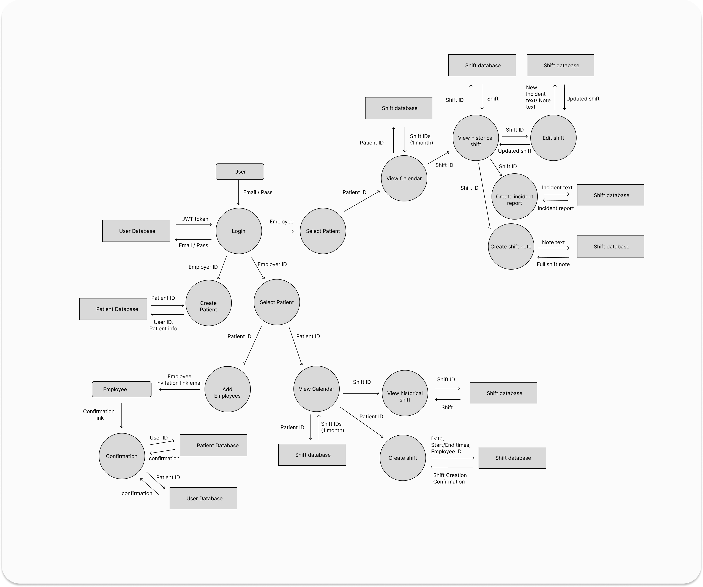
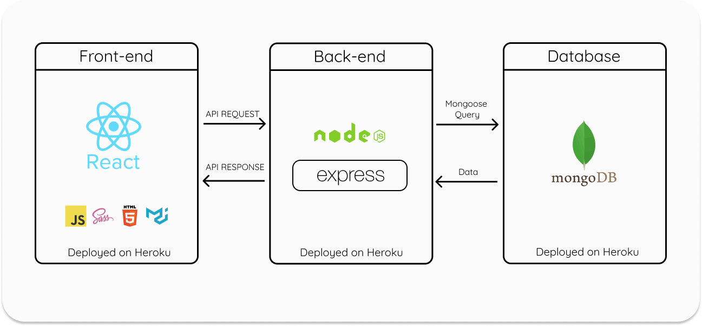
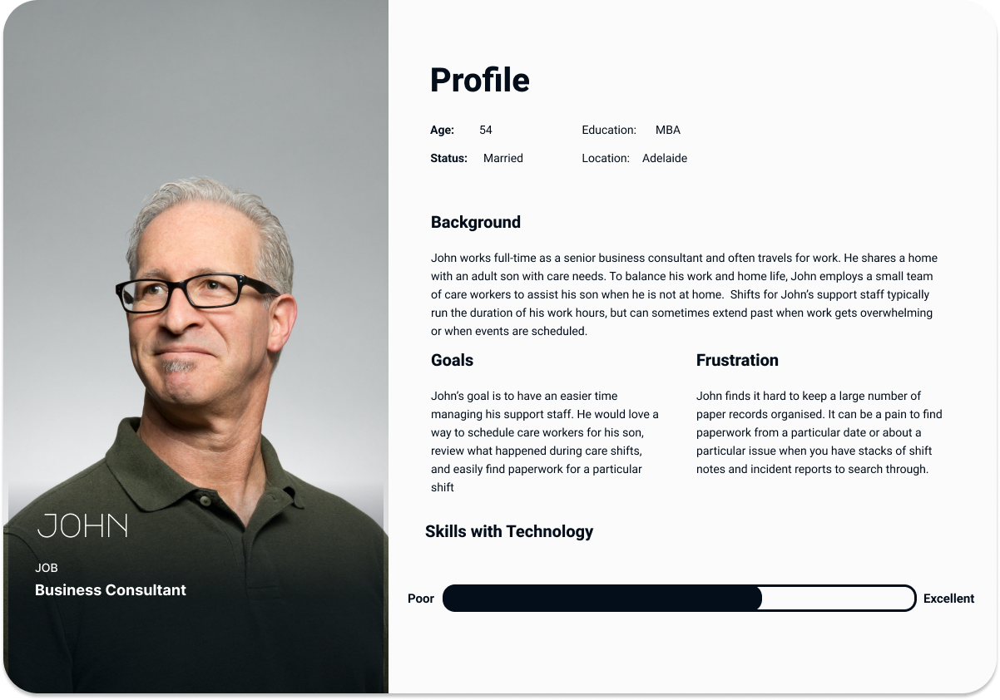

# T3A2-A Full Stack App

 

## Description of Website
### <strong>Purpose</strong>
The purpose of this website is to allow small, self-managed teams of personal carers and support workers to easily create and edit shift notes, incident reports, and handover information as well as provide a rostering system to help organize the workers. In short, this application intends on streamlining scheduling, communication, and provision of care. 

### <strong>Problem</strong>
The problem being solved by this application is that support workers and carers lack any specialized software that is catered toward their specific needs. This community is forced to adapt software intended for other audiences to meet their needs and it often comes up short.  Outside of available software, many care providers and managers (including families of the disabled) often resort to dated methods of reporting and logging shift information/notes. These methods typically include heavy use of paperwork and physical files which are inefficient and exceptionally hard to keep organized. As far as scheduling, the disabilities community typically resorts to using a variety of chat apps in order to schedule their carers which is both chaotic and confusing. This community is in desperate need of an application that can streamline the most time consuming tasks they face daily.

### <strong></strong>

##
### <strong>Functionality/Features</strong>
- Keep a log of each shift including general notes, incident reports, and handover for the next worker.
- Add shift dates and times to a shared roster/calendar.
- Provide the ability to download reports for use in funding applications and psychologist/medical appointments.

### <strong>Target Audience</strong>
The target audience of the application is both those who employ and work in the support/disabilities sector. 

### <strong>Tech stack</strong>
 The tech stack utilized for this project consists of a variety of tools and technologies that we chose based on our personal style of development. For project management, we chose to utilize the Kanban management process to implement agile practices throughout the development of our app. The design tools we chose to use for our initial wireframes, mockups, and diagrams are Balsamiq and Figma. These two were chosen because of their ease of use as well as the ability to easily collaborate with them. The version control system that will be utilized is Git with the assistance of GitHub. Standard git practices will be upheld in order to avoid possible issues when collaboratively working on our codebase. The front-end of the application will consist of React, CSS, HTML, and MUI for more advanced components. The back-end of the application will consist of Node, which will utilize the Express library to make queries to a MongoDB database. 

<strong>Project Management:</strong>
- Trello
- Kanban

<strong>Design Tools:</strong>
- Figma
- Balsamiq

<strong>Version Control:</strong>
- Git
- GitHub

<strong>Front-end:</strong>
- React
- JavaScript
- CSS
- HTML
- MUI

<strong>Back-end:</strong>
- Node.js
- Express.js
- Mongoose
- MongoDB

 

## Dataflow Diagram

 

## Application Architecture Diagram
### MERN Stack
MERN stack is a web development framework that consists of the stack MongoDB, Express.js, React.js, and Node.js. React is used to create the front-end, Express is used as the server-side framework which runs inside a Node server, and MongoDB is used to store any data. 

 

 

## User Personas/Stories
We split our personas into two groups, employees and employers. These groups consist of three personas, each with unique backgrounds and needs which we felt covered the use cases of our application. The three employers covered the roles of parent, support coordinator, and lead support worker. The three employees covered very different use cases that involve specific work styles and possible frustrations that go along with that style.

 

### <strong>Employee Personas:</strong>

### <strong>Employer Personas:</strong>

### <strong>Employee User Stories:</strong>

<strong>Frank -</strong> 
As Frank, a support worker looking for easier access to forms, I want to be able to write and submit incident reports throughout my shift, so that I can write them while they are still fresh in my mind.

<strong>Rosa -</strong> 
 As Rosa, a young support worker looking to streamline the handover process, I want to have quick and easy access to handover notes, so that I can avoid any downtime when my shift starts.

<strong>Grace -</strong> 
As Grace, a support worker that likes to take her clients to do new activities, I want to be able to review historical shift notes so that I can keep my clients doing activities that weren’t done in the days leading up to my shift.

 

### <strong>Employer User Stories:</strong>

<strong>John -</strong> 
As John, a parent who employs carers for an adult son with care needs, I want a way to store all shift notes and incident reports produced by care workers electronically so that I can easily review and retrieve them by date.

<strong>Ellen -</strong> 
As Ellen, the lead support worker for a small team of carers, I would love a place to schedule myself and teammates for care shifts and view a calendar of upcoming shifts so that we can all have a central place to view our roster and avoid miscommunication.

<strong>Sandra -</strong> 
As Sandra, the care coordinator for a small business that assigns carers for many patients, I need a single app that I can use to keep track of all carers assigned to our patients so that I can better manage scheduling.

## Wireframes
### Main application view
Our app visual interface revolves around the calendar as the central component, and we took a mobile-first approach. We wanted to keep things clean and simple, making everything centrally accessible without having to navigate to too many different views. Carers will probably want to be able to quickly enter notes on their phone during a shift, while employers may want to organise their calendar and review shift notes on a larger screen such as a tablet or desktop.

**Main application view for mobile tablet, and desktop**

**Main application view for tablet (portrait vs desktop orientation)**

### Wireflows
#### User login and calendar

#### Shift management (employer)

#### Shift management (carer)

#### Incident report editor

#### Handover notes editor

#### Care team details

#### Shift management flow (Tablet)
On wider displays (tablet and desktop), we can fit more components on a single screen, utilising modals/pullover panels for editing the notes without having to navigate away from the calendar.

#### Additional Shift widget options on wider screens
With these larger components on wider screens, we can also add features such as buttons within the shift thumbnail components to access the handover, shift notes, and incident reports for a particular shift from the calendar view.

## Trello Progress
The following shows our progress of the Trello board throughout the first half of our final assignment. At the start of the project,  we delegated tasks between the two of us based on the amount of time we estimated they would take. Each of us were responsible for our tasks which were turned into "To Do" cards. 

When a team member started on a task, the card would be shifted to the "In Progress" column.  Upon completion, the card would be moved to the "Done" column and the next task would be started.  The "Testing" column is for use in the future when we begin coding the application.

